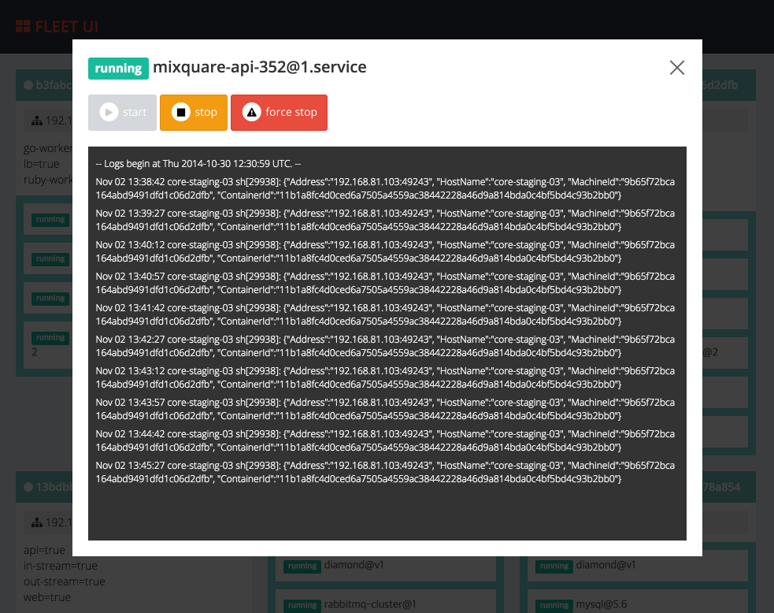

fleet-ui
========

Web based UI for [fleet](https://github.com/coreos/fleet)




## Usage

#### run in docker

```
$ docker build -t purpleworks/fleet-ui .
$ docker run --rm -it -p 3000:3000 -e ETCD_PEER=[your_etcd_peer_ip] -v [your_ssh_private_key_file_path]:/ssh/id_rsa purpleworks/fleet-ui
```

#### run in local dev environment
run api server
```
$ go install
$ fleet-ui -etcd-peer=[your_etcd_peer_ip]
```
run web server

```
$ cd angular
$ npm install
$ grunt serve
```

## Prerequire

#### go 설치

go가 설치되어 있지 않다면, 아래 페이지를 참고하여 go 환경을 설정한다
https://golang.org/doc/install
https://golang.org/doc/code.html#Organization

정상적으로 설치한 후 아래와 같이 go 환경을 확인한다.

```
$ go version
go version go1.3 darwin/amd64
```

```
$ echo $GOPATH
/Users/your_name/workspace/go
```

#### workspace 구성

workspace($GOPATH)에 자신의 github 계정으로 fork한 fleet-ui 소스를 내려받는다.

```
$ mkdir $GOPATH/src/github.com
$ cd $GOPATH/src/github.com
$ git clone git@github.com:your_name/fleet-ui.git
```

최종적으로 아래와 같은 구조가 되도록 한다
```
bin/
pkg/
src/
    github.com/
        your_name/
          fleet-ui/
              .git/
              Dockerfile
              README.md
              app.go
              start.sh
```

## 실행

#### web server 실행

```
$ go install && fleet-ui
```

#### rest api 확인

```
$ curl http://localhost:3000/api/v1/units
```

## API 정보

#### REST API

- [GET] /api/v1/machines  
전체  machine 목록 조회
- [GET] /api/v1/units  
전체  unit 목록 조회
- [POST] /api/v1/units  
service unit 등록(필수 파라미터: name, service)
- [POST] /api/v1/units/upload  
service unit file 업로드 & 등록(필수 파라미터: file 객체)
- [GET] /api/v1/units/{unit-name}  
특정 unit 조회
- [DELETE] /api/v1/units/{unit-name}  
특정 unit 제거
- [POST] /api/v1/units/{unit-name}/start  
특정 unit 시작
- [POST] /api/v1/units/{unit-name}/stop  
특정 unit 중지
- [POST] /api/v1/units/{unit-name}/load  
특정 unit 로드

#### Web socket

- ws://ws/journal/{unit-name}
특정 unit journal 조회

## Contributing

1. Fork it ( https://github.com/purpleworks/fleet-ui/fork )
2. Create your feature branch (`git checkout -b my-new-feature`)
3. Commit your changes (`git commit -am 'Add some feature'`)
4. Push to the branch (`git push origin my-new-feature`)
5. Create a new Pull Request
